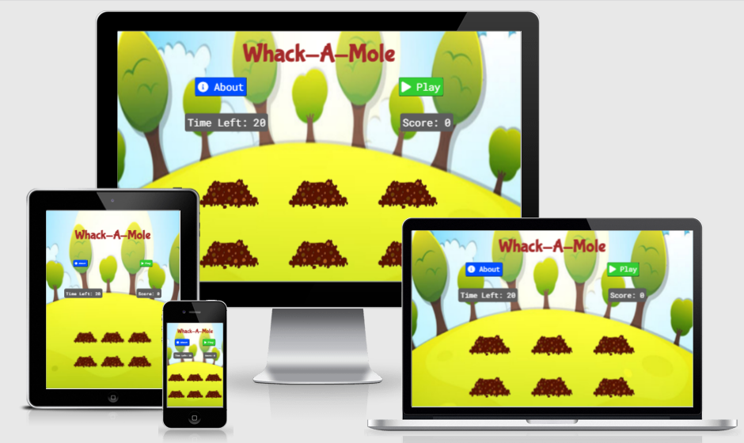
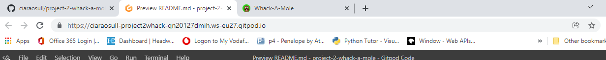
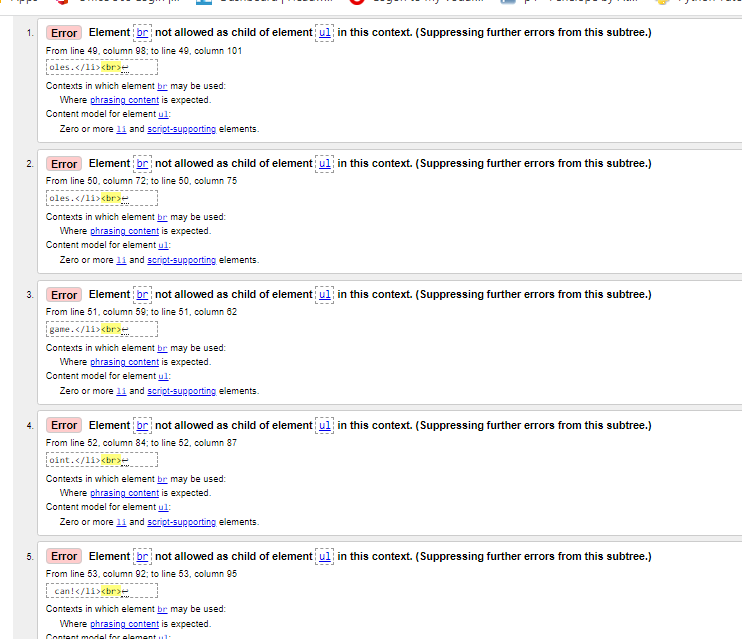
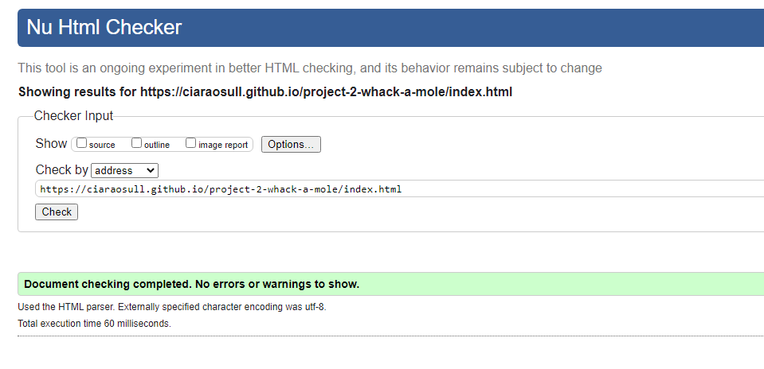
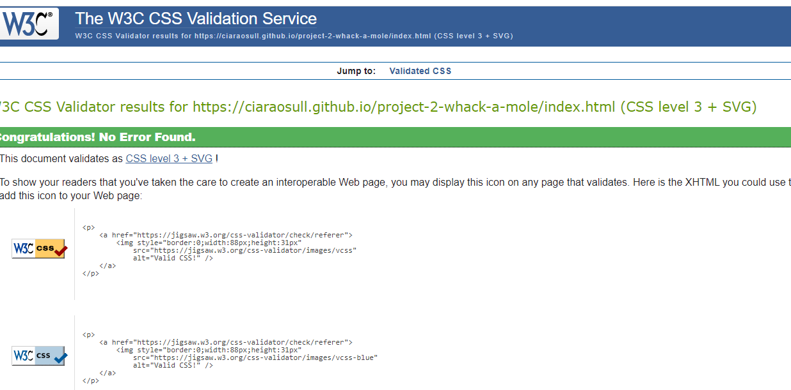
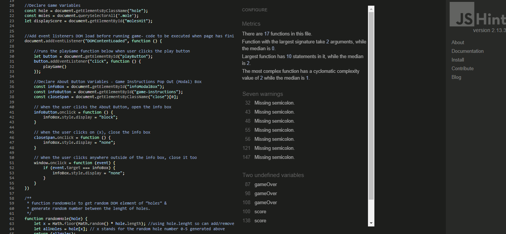
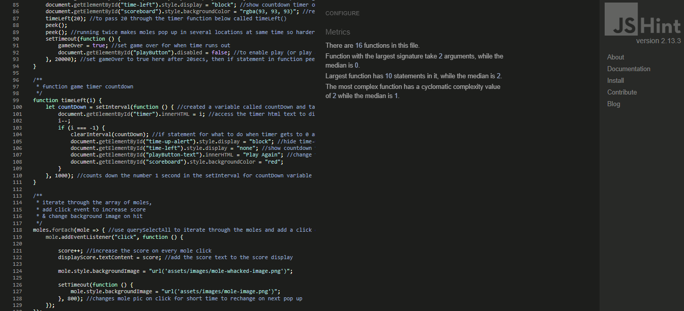
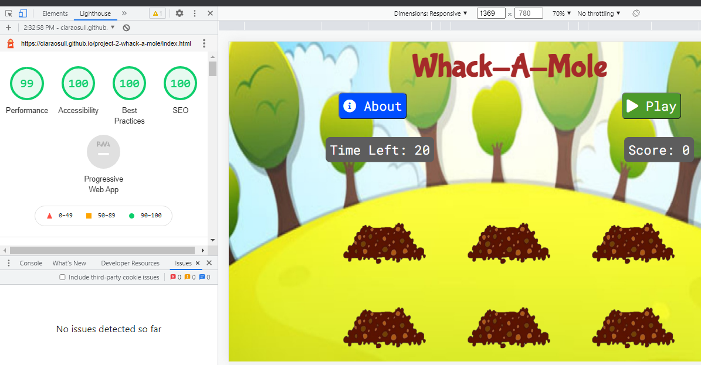

# **Whack-A-Mole**

[View the live project here](https://ciaraosull.github.io/project-2-whack-a-mole/index.html)

Whack-A-Mole is an arcade game from the 1970's where a player used a mallet to hit the moles as the randomly popped out of holes, to score points.  This game was chosen as it seems to appeal to the target audience of children aged 4-8 years old because the instructions on game play are not overly complicated, the game play time can be short to hold focus and interest and the game could be designed in a way to be bright, cheerful, funny and interactive to the target audience.  As children aged 4-8 years are at entry level reading, this game does not require lots of reading to interact and play.  This game is contained on one page so it is easliy accessible and allows the target audience to interact immediately without having to follow any instructions or navigate their way through different pages to access the game play.  The main reason why this game was chosen is that there is potential for this game to be developed further to act as a fun, interactive Reading and Maths game for children aged 4-8 years, which is explained below in the Features Left to Impliment Section.

# **User Experience (UX)**
### User Stories

Target Audience - Children Aged 4-8 Years

As a User I want to:
*    play the game clearly across different devices
*   play the game instantly and not have to type in anything that invloves spelling or tyring to read to navigate around different sections or pages
*   understand how to play the game with not much reading or instructions involved
*   play a game that does not take a long time to complete
*   know how much time I have left to play and when time is up
*   know what score I achieved
*   know when exactly I have scored
*   have fun and see interesting, funny and engaging characters that are appropriate for my age
*   have the choice to easily play again

**User Experience in this Site**

The following takes each of the above points in the user stories and explains why the different features where designed and implimented to create a positive user experience.

# **Design**

The design of the site was inspired by researching other online games to discover what aspects of their design made a positive user experience. The sites were accessed across several devices to understand what layout and features worked best on each device and had a positive impact on the user.

### Design Research

### Design Drawings

### Fonts

### Colour Scheme

## Features
1. **Favicon**
    * A favicon was generated by uploading a mole image for the logo to [Favicon Generator](https://realfavicongenerator.net/).  This then generated an icon that was saved in the assests images folder and linked in the head section of the html.
    * A favicon consistant with the theme of whack-a-mole was chosen to be asscociated with this website as an extra visual support for the user and to create a positive user experience.  It should create brand awareness and recognizability for the user visually and help them find the page quicker and easier.

    

2. **Feature 2**

    

3. **Feature 3**

    

4. **Feature 4**

5. **Page Not Found - 404 Page**
    * A customised 404 page not found was added to the site to support the professionalism design and ensure appropriate link was added back to the main site to guide users who come across this message.

    * An image from the website is used for consistancy and the link back to the main website has a line underneath and letter spacing on hover to provide feedback to the user.  Inline css was used within the 404.html page to prevent further errors being shown if the style sheet fails to load from a link.

    

### Features Left to Implement

### Limitations

## Languages Used

HTML, CSS, JavaScript

## Testing

*   Methods such as testing by clicking, hovering and Chrome Developer Tools during this project's development were used to test for bugs in the HTML, CSS and JS code.  The Elements section was used for the HTML & CSS.  The Console was used to check the JS.  Any errors or warnings were fixed as they appeared.  Use of console.log() and for click events, alert(), were used as the code was written helped check everything was behaving as expected and functions such as random whole numbers or random holes were being generated correctly.  

*   After each function was written it was tested using these methods mentioned above before moving on.  This helped keep tracking down issues and bugs to a minimum.

*   After deployment all features were checked on laptop, mobile (Samsung Galaxy & iPhone 8). The site was sent to peers to check from their devices that all features functioned correctly and feedback on responsiveness and functionality was positive across all devices checked such as PC, Laptop, Tablets and Mobiles (Android & IOS). The website was checked on Chrome, Firefox and Edge.  It was also check by a user in Internet Explorer 7.  (see issue 3 Background Colour in the Interesting Issues, Bugs Found & Fixed section).

*   The About button was tested to ensure it changed colour on hover and that it functioned on click to open the How to Play Modal Box.

*   The How to Play Modal Box was also tested.  The X to close in the righthand corner changed colour when hovered over and also closed the box when clicked.  Also, tested was if a user clicked anywhere outside the box, this would also close it.  This box was tested to ensure that it opened during game play incase the user needs to check the instructions after the game starts.  All this functioned as expected.

*   The Play button was tested to ensure it changed colour on hover and that it functioned on click to start the game.  It was tested to check it was disabled during game play but enabled and changed to Play Again once the game play was over.

*   The Time Left indicator was checked that it started at 20 before game started and that it counted down to 0 before game was over.  Also checked was that the Time Left indicator changed to Time Up when it reached 0 and the background changed colour.  If Play Again was chosen by the user it was checked that Time Left Indicator displayed again and functioned accordinly.

*   The Score indicator was tested to ensure that on each correct hit / click of a mole it increased by 1.  This was checked to ensure it changed colour and displayed the correct final score when the game time was up.  Also, tested was that on Play Again, the Score reset back to 0.

*   The moles were checked that they were not visible before the Play / Play Again button was clicked.  Testing, (e.g. using console.log) that moles appeared from a random hole for a random time before disappearing.  Also, the moles were checked that they responded when clicked and that the image of the mole changed on a successful hit.  After successful hit image was triggered, it was checked that when the moles reappeared the original mole image could be seen.  By clicking on other parts of the page such as the holes or background it was tested that this did not respond as a mole hit and only the mole image itself being clicked was a succeful hit on click.

*   For Desktop the cursor image was checked that the mallet image only appeared around the hole and mole section of the game and turned back into a regular arrow image on the other sections of the page.  The coordinates at which the pointer clicked was checked that it was in line visually with the flat part of the mallet image.

*   The Page not Found 404.html was also checked by entering in a mistake in the url bar. Once taken to the 404 page the link there was checked that it took the user back to the main site.

*   The README.md was proof-read and all links were checked before final submission.

### Interesting Issues Bugs Found & Fixed

**Clicking on Mole Bug**

Three issues arose while trying to impliment addEventListener to the moles.  This fuction was to have several events happen once the moles were clicked, such as add to the score and sned the moles back down the hole once clicked.  

* The first problem was that the moles were treated as an array.  As such the forEach method threw an error in the console stating that forEach was not a function.  As getElementByClassName was used to select the moles, this returned them as a HTML collection so there were 3 options to choose from.  At first a for(of) loop was chosen to iterate through the array to then assign the addEventListener.  However, it was decided to use querySelectorAll instead, as this returned a NodeList, which is not live, so if any changes to the DOM happen this won't alter the NodeList.  After the querySelectorAll was used for the moles then forEach was used and the addEventLister applied to all moles returned.

* After this was fixed, however a second problem came to light.  The addEventListener still did not seem to be taking affect.  Using Chrome DevTools to inspect closer at the areas chosen when the moles were clicked it showed what was actually being clicked was the hole divs and as the mole divs were sitting behind them, they could not be clicked.  To fix this the z-index was removed from the mole divs and the addEventListener then worked as they could be clicked.

* The third problem then arose because the z-index was removed, the moles now sat in front of the holes and could be seen making the transition from Top: 100% to Top: 0.  To fix this, the transition of 2seconds was removed, and moles now just appear out of the hole and disappear again without a raising up effect.  Given more time, the css could be altered to place the divs containing the holes lower down so the Top: 0 starts at the hole opening.  However, as time was a constraint at this time, the removal of the transition was used.

**Peek Function**
* An issue arose with the Play button not being diasabled and it was discovered that the user may be able to click Play during the game play causing the Peek Function to run multiple times simultainiously.

* Interestingly though, by discovering this bug, running the Peek Function twice simultainiously gave the effect of more than one mole peeking out at a time.

* The Play button was disabled during game play to fix this error, however, the Peek Function was placed in the game twice to keep this very nice effect.  Any more than running Peek twice at any one time, however, just made all the moles pop up almost at the same time constantly.

**Background Colour**
*   An issue arose for one user who chose to play the game on a PC that had Internet Explorer 7.  Game functionality worked as expected and all styling showed except for 1 section that used rgba for a colour choice.  The Time Left, Score and How to Play content all used this rgba gray colour and they did not display at all.  There was the option to insert a fallback colour as suggested by this [CSS Tricks article](https://css-tricks.com/ie-background-rgb-bug/), however, as hex values were already being used throughout, it was decided just to change this to hex instead as a fix.

### Validator Testing

Before testing, code was checked and formatted by right clicking and choosing - format document.

1. The [W3C](https://validator.w3.org/) site was used to validate the **HTML** code.

    It returned 5 errors on the index.html page all stating that the break tag cannot be used within a list.  
    
    
    
    The break points used were removed and to add spacing the list items were targeted in CSS with padding instead.  The validator was rerun and came back clear.

    

2. The [W3C](https://jigsaw.w3.org/css-validator/) site was also used to validate the **CSS** code.  It returned no errors on the style.css file.

    

3. [JSHint](https://jshint.com/) site was used to validate the **JavaScript** code. It returned errors with semi-colons missing and also, 2 variables were reported to not be declared.

    

    The semi-colons were put in the correct place and the 2 undeclared variables were defined globally.  Given more time, if this happened for future projects, more time could be spent on designing these variables to avoid creating them globally.  JSHint then revealed no errors or warnings.

    

4. **Lighthouse** was accessed through Developer Tools in Chrome to check the site for performance, accessibility, best practice, and SEO.  The test was done **incognito** window to account for extensions on the testing laptop etc. 

    The first time this was run, the accessibility returned a recommendation to change the contrast on the Play Button background a foreground.  A slightly darker shade of green was used instead to give more contrast to the white Play writing.  Lighthouse was checked again, and accessibility returned 100% this time.

    

## Deployment
The site was deployed to GitHub pages. The steps to deploy are as follows:

* In the GitHub repository, navigate to the Settings tab.

* On the left hand side menu, choose Pages.

* From the source section drop-down menu, select the Main branch and then press Save.

* The next page will displlay a notice stating the site is ready to be published. 

* Refresh GitHub and the display will now state the site is published.

The live link is: https://ciaraosull.github.io/project-2-whack-a-mole/index.html

* Visual Studio (VS) Code was the Integrated Development Environment used to develop this ebsite.

### Version Control
* Git was used as the version control software.  Commands such as git add ., git status, git commit and git push were used to add, save, stage and push the code to the GitHub repository where the source code is stored.

### Cloning
To clone this repository from [GitHub](www.github.com) to a local computer to make it easier to fix merge conflicts, add or remove files, and push larger commits or contribute use the following steps:

1. On [GitHub](www.github.com), navigate to the main page of the repository.  [Click Here for Reposititory Link](https://github.com/ciaraosull/project-2-whack-a-mole)

2. Above the list of files, click Code.

3. click Use GitHub CLI, then the copy icon.

4. Open Git Bash and change the current working directory to the location where you want the cloned directory.

5. Type git clone, and then paste the URL that was copied from step 3 above.

6. Press Enter to create the local clone.

## Credits
**Content**

Some helpful tutorials I used to help me with coding some of the design ideas were:

[Modern JavaScript Tutorials by The Net Ninja](https://www.youtube.com/watch?v=FhguwBJeqWs)

[Whack-A-Mole with Vinilla JS](https://youtu.be/toNFfAaWghU)

[Whack-A-Mole in JavaScript](https://youtu.be/rJU3tHLgb_c)

Some resources that helped fix particular issues or learn to impliment specific features were:

*   [Fixing z-index bug by Coder.com](https://coder-coder.com/z-index-isnt-working/)

*   [Making an Image Responsive by Browserstack.com](https://www.browserstack.com/guide/how-to-make-images-responsive)

*   [Centering Absolute Elements by Thoughtbot.com](https://thoughtbot.com/blog/positioning)

*   [Allowing only 1 click in Javascript by Code-Boxx.com](https://code-boxx.com/allow-one-click-javascript/)

*   [HTML Collection Loops by GeeksforGeeks.og](https://www.geeksforgeeks.org/htmlcollection-for-loop/)

Other resources used to learn were:

* W3Schools
* CSS Tricks
* Stack Overflow

**Media**
The icons in the footer were taken from Font Awesome

The Images were chosen from the following and edited in MS Paint3D:
* Pixabay
* Pexels
* Free Images

## Acknowledgements
This site was made possible due to the help, advice and support of my Code Institue Tutor Kasia, my Mentor Daisy and all the lovely people on the Code Institue Slack community.

## Continued Professional Development
During the design phase of this project, ideas were sketched out with paper and pencil.  My goal is to learn how to use Balsamiq WireFrames in order to implement this as a method of designing future projects.

I would like to learn more about scoping and practice avoiding creating global variables.  While I was mindful of avoiding this during the project development I still feel I would like more practice. 

