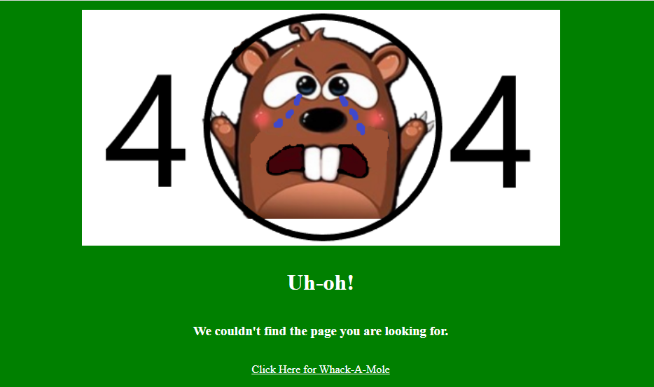

# **Whack-A-Mole**

[View the live project here](https://ciaraosull.github.io/project-2-whack-a-mole/index.html)

# **User Experience (UX)**
**User Stories**

A user also wants to:

Easily understand the main purpose of the site
Be able to navigate easily throughout the site
Understand the information presented in clear, jargon free language
Use the practice audio session and have control over when it plays and pausing
Be able to contact the organisation or the author of the site
Be able to find the link to download the organisations app
View the website clearly across different devices.

**User Experience Research**

**User Experience in this Site**

# **Design**

The design of the site was inspired by researching other online games to discover what aspects of their design made a positive user experience. The sites were accessed across several devices to understand what layout and features worked best on each device and had a positive impact on the user.

**Design Research**

**Design Drawings**

**Fonts**

**Colour Scheme**

## Features
1. **Favicon**
    * A favicon was generated by uploading a mole logo to [Favicon Generator](https://realfavicongenerator.net/).  This then generated a 16x16 icon that was saved in the assests images folder and linked in the head section of the html.
    * A favicon consistant with the theme of whack-a-mole was chosen to be asscociated with this website as an extra visual support for the user and to create a positive user experience.  It should create brand awareness and recognizability for the user visually and help them find the page quicker and easier.

    

2. **Feature 2**

    

3. **Feature 3**

    

4. **Feature 4**

5. **Page Not Found - 404 Page**
    * A customised 404 page not found was added to the site to support the professionalism design and ensure appropriate link was added back to the main site to guide users who come across this message.

    * An image from the website is used for consistancy and the link back to the main website has a line underneath and letter spacing on hover to provide feedback to the user.  Inline css was used within the 404.html page to prevent further errors being shown if the style sheet fails to load from a link.

    

**Features Left to Implement**

**Limitations**

## Languages Used

HTML, CSS, JavaScript
---

## Testing
Testing

## **Interesting Issues & Bugs Found**

* Validator Testing

1. The [W3C](https://validator.w3.org/) site was used to validate the **HTML** code.

2. The [W3C](https://validator.w3.org/) site was also used to validate the **CSS** code.

    

3. **Lighthouse** was accessed through Developer Tools in Chrome to check the site for performance, acessibility, best practice and SEO.   

## Deployment
The site was deployed to GitHub pages. The steps to deploy are as follows:

In the GitHub repository, navigate to the Settings tab.

On the left hand side menu, choose Pages.

From the source section drop-down menu, select the Main branch and then press Save.

The next page will displlay a notice stating the site is ready to be published.

Refresh GitHub and the display will now state the site is published.

The live link is: https://ciaraosull.github.io/project-2-whack-a-mole/

Visual Studio (VS) Code was the Integrated Development Environment used to develop this website.

**Version Control**
Git was used as the version control software. Commands such as git add ., git status, git commit and git push were used to add, save, stage and push the code to the GitHub repository where the source code is stored.

**Cloning**

To clone this repository from GitHub to a local computer to make it easier to fix merge conflicts, add or remove files, and push larger commits or contribute use the following steps:

On GitHub, navigate to the main page of the repository. Click Here for Reposititory Link

Above the list of files, click Code.

click Use GitHub CLI, then the copy icon.

Open Git Bash and change the current working directory to the location where you want the cloned directory.

Type git clone, and then paste the URL that was copied from step 3 above.

Press Enter to create the local clone.

## Credits
**Content**

Some helpful YouTube tutorials I used to help me with coding some of the design ideas were:

Net Ninja Channel

Other resources used to learn were:

W3Schools
CSS Tricks
Stack Overflow

**Media**
The icons in the footer were taken from Font Awesome

Pixabay
Pexels
Free Images

## Acknowledgements
This site was made possible due to the help, advice and support of my Code Institue Tutor Kasia, my Mentor Daisy and all the lovely people on the Code Institue Slack community.

## Continued Professional Development

